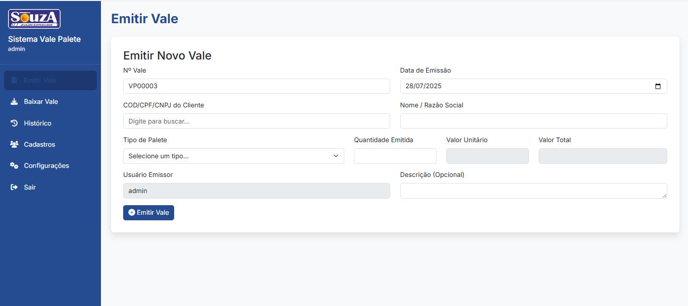
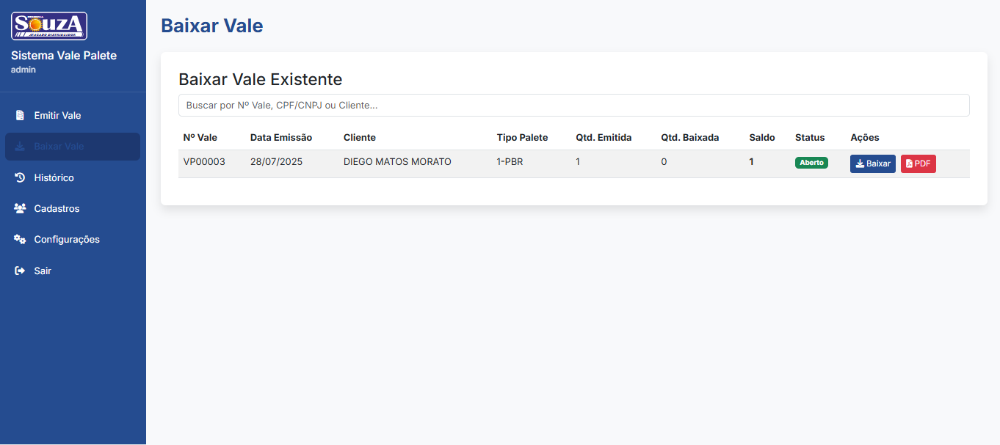
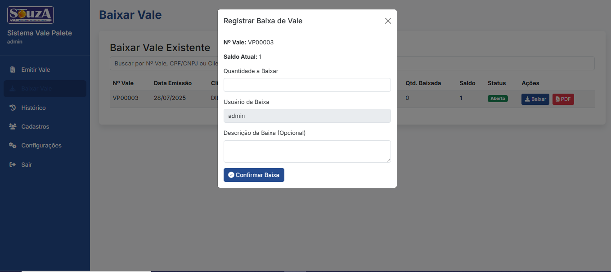
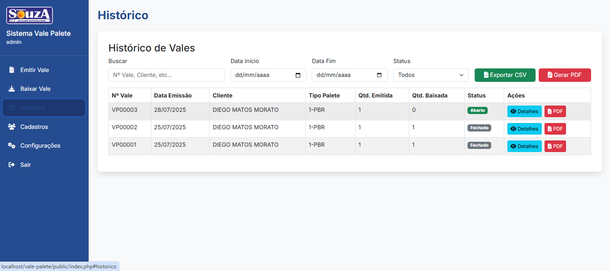
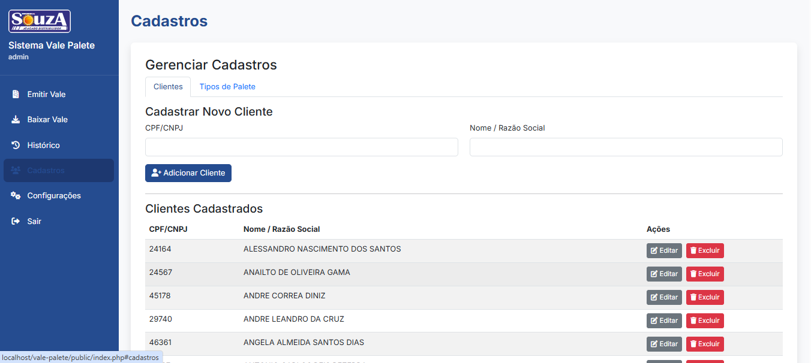
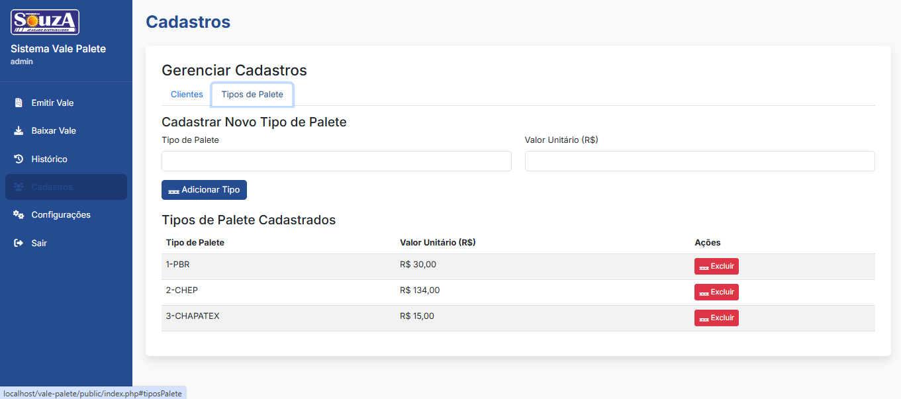
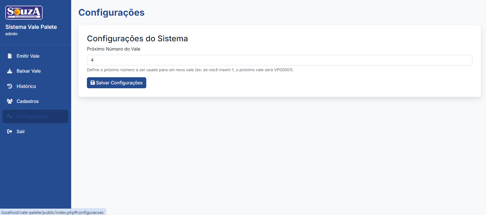

# 📦 Sistema de Vale Palete

[!Status]()
[!PHP]()
[!XAMPP]()
[!Banco]()

---

## 📝 Descrição

**Contexto:**  
O controle de paletes (PBR) é um desafio logístico e financeiro. A gestão manual desses ativos, que possuem valor monetário, resultava em perdas, falta de rastreabilidade e dificuldades na cobrança de clientes que não devolviam os paletes.

**Ação:**  
Foi desenvolvido o "Sistema de Vale Palete", uma aplicação web para registrar e controlar todo o ciclo de vida dos vales. O sistema centraliza a emissão, a baixa (devolução) e o histórico de todas as transações.

**Resultado:**  
A solução implementou um controle rigoroso sobre os paletes, fornecendo uma visão clara de quais clientes possuem vales em aberto e os saldos devedores. A geração de vales em PDF com numeração única e a integração com uma base de usuários centralizada trouxeram segurança e profissionalismo ao processo, reduzindo perdas e otimizando a gestão logística.

---

## 🔧 Funcionalidades Principais

✅ **Autenticação Segura:** Login integrado com base de dados de usuários central (`intranet`).  
✅ **Emissão de Vales:** Geração de vales com numeração sequencial, busca de clientes e cálculo de valores.  
✅ **Baixa de Vales:** Registro de devoluções parciais ou totais, com atualização automática de status.  
✅ **Histórico Completo:** Tabela com filtros avançados (data, status, busca) e exportação para CSV e PDF.  
✅ **Impressão de PDF:** Geração de um vale físico em PDF com duas vias (Empresa e Motorista).  
✅ **Cadastros Centralizados:** Gerenciamento de clientes e tipos de paletes com seus valores.  
✅ **Configurações Flexíveis:** Permite ajustar o próximo número de vale a ser gerado.

---

## 📁 Estrutura do Projeto

```
vale-palete/
├── api/                  # Endpoints PHP para as operações do sistema (CRUD)
├── config/               # Configuração da conexão com o banco de dados
├── public/               # Pasta raiz da aplicação, acessível pelo navegador
│   ├── images/           # Recursos visuais (logo, background)
│   ├── index.php         # Interface principal do sistema (SPA)
│   ├── login.php         # Tela de autenticação de usuários
│   ├── logout.php        # Script para encerrar a sessão
│   └── script.js         # Lógica JavaScript do frontend
├── vendor/               # Dependências de terceiros (gerenciadas pelo Composer)
├── .gitignore            # Arquivos e pastas a serem ignorados pelo Git
├── composer.json         # Declaração das dependências do projeto
└── README.md             # Esta documentação
```

---

## 🛠️ Como Executar (Ambiente Local)

1.  Instale o XAMPP (ou um ambiente similar com PHP e MySQL).
2.  Copie a pasta `vale-palete/` para `C:/xampp/htdocs/`.
3.  Inicie os módulos **Apache** e **MySQL** no painel do XAMPP.
4.  Crie os bancos de dados `intranet` e `vale_palete` no **phpMyAdmin**.
5.  Importe os arquivos `.sql` com a estrutura das tabelas para cada banco de dados.
6.  Abra um terminal na pasta do projeto (`C:/xampp/htdocs/vale-palete`) e execute `composer install` para baixar as dependências (como o mPDF).
7.  Acesse no navegador:
    ```
    http://localhost/vale-palete/public/
    ```

---

## 🔐 Usuários e Permissões

- **Autenticação:** Os usuários são validados contra a tabela `users` no banco de dados `intranet`.
- **Segurança:** As senhas são armazenadas de forma segura usando criptografia hash.
- **Sessão:** Após o login, os dados do usuário (ID, nome, permissão) são armazenados na sessão PHP para uso no sistema.

---

## 📸 Capturas de Tela

### 1. 🔐 Autenticação
*Interface de entrada do sistema, com a identidade visual da empresa.*


### 2. 🧾 Emissão e Baixa de Vales
*Fluxo principal de operações do sistema.*


*Tela de emissão de um novo vale.*


*Tabela com vales em aberto, pronta para registrar a devolução.*


*Modal para dar baixa parcial ou total em um vale.*

### 3. 📜 Histórico e Relatórios
*Visualização completa de todos os vales, com filtros e opções de exportação.*


### 4. ⚙️ Cadastros e Configurações
*Telas de apoio para gerenciamento de clientes, paletes e configurações do sistema.*


*Gerenciamento da base de clientes.*


*Definição dos tipos de paletes e seus respectivos valores.*


*Ajuste de parâmetros do sistema, como o próximo número de vale.*

### 5. 📄 Exemplo de Vale PDF
*Demonstração do documento PDF gerado pelo sistema, com as duas vias.*


---

## 👨‍💻 Autor

**[Seu Nome Aqui]**  
Sistema desenvolvido para otimizar a gestão de ativos logísticos.

---

## 🤝 Colaboradores

**Saulo Sampaio.

---

## 📄 Licença

Projeto de uso interno.  
Livre para adaptar conforme a necessidade da empresa.
